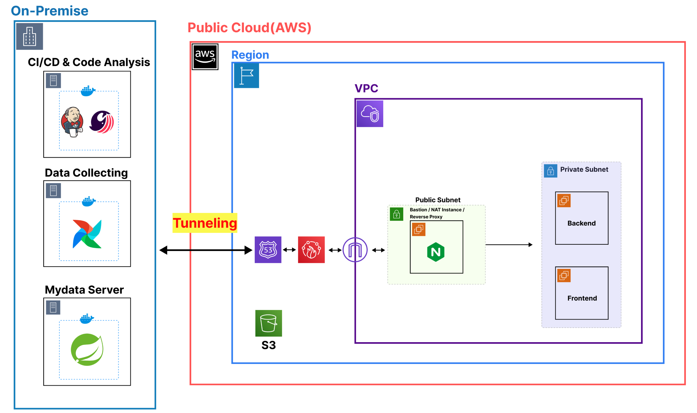
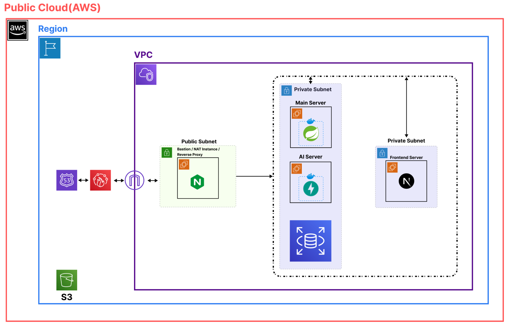
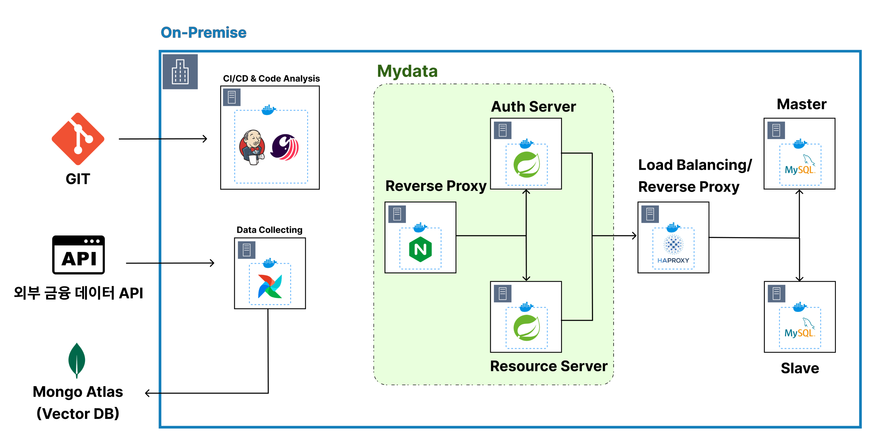

# KnowWhoHow Backend

> **노후 준비, 어떻게(How) 해야 할까?**
> 고객이 누구인지를 깊이 이해하고(`Know Who`), 그들에게 딱 맞는 노후 솔루션을 제시(`Know How`)하는 시니어 통합 자산 관리 & 라이프 케어 플랫폼 **노후하우(KnowWhoHow)** 의 백엔드 서버입니다.
> 
> 

---

## 1. 표지

---

## 2. 프로젝트 소개

노후하우(KnowWhoHow)는 초고령 사회 진입에 맞춰 시니어층의 전 생애주기 고민(자산 관리, 일자리, 상속/디지털 유산)을 하나의 플랫폼에서 해결하는 **시니어 맞춤형 포용 금융 앱**입니다.

* **맞춤형 자산 설계**: MyData 자산 연동, 포트폴리오 진단, 금융 상품 시뮬레이션

* **AI 자산 관리 상담**: RAG(Retrieval-Augmented Generation) 기반 시니어 전용 금융 상담 챗봇

* **시니어 일자리 연계**: 위치 기반 공공 구인 API를 활용한 맞춤형 채용 정보 탐색

* **디지털 유산 & 상속**: 법정상속분/유류분 시뮬레이션 및 S3 멀티파트 업로드 기반 영상 편지 예약 발송

---

## 3. 프로젝트 배경

**초고령 사회 진입과 자산의 불균형**

* 65세 이상 인구 비중 20% 돌파, 고령층 자산 규모는 커졌으나 부동산 평균 비중이 68.2%, 금융 자산 중 예적금 비중이 88%로 **유동 현금 흐름 창출 능력이 현저히 부족**함.

**분산 투자 부족 및 정보 격차**

* 낮은 소득층일수록 자산 운용 기회가 부족하고 원리금 보장형 상품에 치중되어 **자산 성장이 정체**됨.

**기존 금융 플랫폼의 한계**

* 기존 시니어 금융 서비스는 특정 은행에 종속적이거나 단순 정보 제공에 그쳐 **상속, 신탁, 은퇴 후 일자리까지 아우르는 모바일 통합 케어가 부재**함.

 **해결 방안**

* AI 기반 가이드라인 제공 및 사용자 맞춤 자산 유동화 전략을 제공하여 **정보 소외를 넘어 포용 금융을 실현**함.

---

## 4. 주요 기능

| 도메인 | 주요 기능 | 상세 설명 |
| :--- | :--- | :--- |
| **인증/회원** | 회원가입 및 프로필 | CoolSMS 휴대폰 인증, Kakao OAuth2, JWT 재발급, 투자 성향 및 은퇴 키워드 관리 |
| **자산 관리** | 포트폴리오 진단 | 자산 및 소득·지출 기반 예금형/적금형 유형 판별, 예/적금 만기 금액 시뮬레이션 |
| **MyData** | 자산 데이터 연동 | Auth Code 기반 연동, Access Token Redis 저장, 백그라운드 Worker 스냅샷 갱신 |
| **AI 챗봇** | RAG 기반 상담 | Airflow-MongoDB Atlas 기반 벡터 검색, 실시간 Re-Ranking, 프롬프트 인젝션 방어 |
| **일자리** | 맞춤 채용 정보 | 위치 기반(GeoCoding) 노인 구인 Open API 조회, Redis 3단계 캐싱으로 성능 최적화 |
| **상속/유산** | 유산 및 영상 편지 | 법정상속분/유류분 차이 계산, S3 Presigned URL 멀티파트 업로드, SMTP 예약 발송 |

---

## 5. 핵심 기능 (Deep Dive)

### 1) RAG 기반 AI 자산 관리 상담 챗봇

* **자동화 파이프라인**: Apache Airflow를 통해 매일 새벽 금융 데이터를 수집·전처리 및 `gemini-embedding-001`로 임베딩하여 MongoDB Atlas Vector Search에 적재.

* **사용자 피드백 Re-Ranking**: 사용자의 '좋아요/싫어요' 피드백을 실시간 기록하여 추천 결과에 반형 (Re-Rank).

* **보안 & 가이드라인**: 프롬프트 인젝션 키워드 차단 및 금융소비자보호법 6대 판매 원칙 준수 가이드 적용.

### 2) Redis를 활용한 외부 Open API 성능 최적화

* **문제점**: 공공 일자리 API의 응답 지연(최대 10초 이상) 및 상세 API 내 고용 형태 데이터 누락.

* **해결책**: 3계층 캐싱 구조 도입

* `jobs:list:` (TTL 10분) - 목록 검색 조건 저장

* `job:detail:` (TTL 1시간) - 상세 정보 저장

* `job:extra:` (TTL 24시간) - 상세 응답 보합용 데이터 저장

### 3) 대용량 영상 편지 멀티파트 업로드 & 예약 발송 System

* **대용량 파일 처리**: AWS S3 Presigned URL + Multipart Upload 방식을 적용해 서버 트래픽 부하 최적화.

* **보안 링크 및 스케줄러**: 매분 실행되는 `InheritanceScheduler`가 수혜자에게 일회성 보안 토큰 링크를 SMTP로 전송.

---

## 6. 시연 영상

> 아래 이미지를 클릭하거나 링크를 통해 주요 기능 시연 영상 및 동작 흐름을 확인할 수 있습니다.
> 
> 

* **메인 시연 영상**: `https://github.com/your-repo/demo-video.mp4` *(링크 수정 필요)*

* **주요 시연 스크린샷**:
| 회원가입 & 키워드 설정 | 자산 포트폴리오 진단 | AI 상담 챗봇 |
| --- | --- | --- |
|  |  |  |

---

## 7. 기술 스택

### Application & Framework

* **Java 17** / **Spring Boot 3.2.5**

* Spring Web MVC, Spring Security, Spring Data JPA, Spring WebFlux (`WebClient`)

* **FastAPI** (AI Server)

* Resilience4j (외부 API 장애 격리 및 Circuit Breaker)

### Data & Infrastructure

* **MySQL**: 서비스 영속 데이터 관리

* **Redis**: JWT, OTP, MyData Access Token, Lock, 채용 API 캐시

* **MongoDB Atlas**: Vector Search (금융 상품 임베딩 데이터)

* **Apache Airflow**: 금융 데이터 ETL 및 임베딩 자동화 파이프라인

* **AWS S3**: 대용량 영상 파일 저장소

* **Docker / Docker Compose / Nginx**

---

## 8. 인프라 구조도

인프라는 하이브리드, AWS 클라우드, 온프레미스의 세 가지 관점으로 구성됩니다.

### 1) 하이브리드 아키텍처

민감 정보 보호와 비용 효율성을 위해 온프레미스와 AWS를 터널링으로 연결했습니다. CI/CD·데이터 수집·MyData는 온프레미스에서, Main·AI·Frontend 서버는 AWS Private Subnet에서 운영합니다.

### 2) AWS 클라우드 아키텍처

외부 요청은 Route 53과 WAF를 거쳐 Public Subnet의 Nginx Reverse Proxy로 전달된 후, Private Subnet의 대상 서버로 라우팅됩니다. 내부 서버의 직접 SSH 접근은 차단하며, 허용된 IP의 관리자만 분리된 접속 키와 SSH ProxyJump를 사용해 Bastion Host를 경유합니다.

### 3) 온프레미스 아키텍처

온프레미스에는 CI/CD와 MyData 시스템을 구성했습니다. Jenkins는 관리자 IP만 허용하고 민감 정보는 Credentials로 관리하며, MyData 트래픽은 Nginx와 HAProxy를 거쳐 Master·Slave DB로 분산됩니다. Airflow가 수집한 금융 데이터는 MongoDB Atlas의 벡터 검색에 활용됩니다.

## 9. Contributors

| Name | Role | Responsibilities |
| :---: | :---: | :--- |
| **조원희** | PM / 백엔드 | 메인 백엔드 아키텍처 설계, 마이데이터 서버 구축 |
| **이종혁** | PL / 프론트 / 백엔드 / AI | UI/UX 디자인, 회원 인증/가입 API 및 보안 로직 구현, 자산 포트폴리오 진단 서비스 개발, RAG AI 상담 챗봇 파이프라인 구축 |
| **오지영** | 디자인 / 프론트 / 백엔드 | 로고 디자인, 백엔드 시스템 개발, ELK 로그 시스템 환경 설정 |
| **양유진** | 디자인 / 프론트 / 백엔드 | UI/UX 디자인, 디자인 시스템 설계, 상속 설계 및 영상편지 발송 로직 구현, 일자리 찾기 서비스 개발 |
| **김현진** | 인프라 | 클라우드 VPC/네트워크 구축 |
